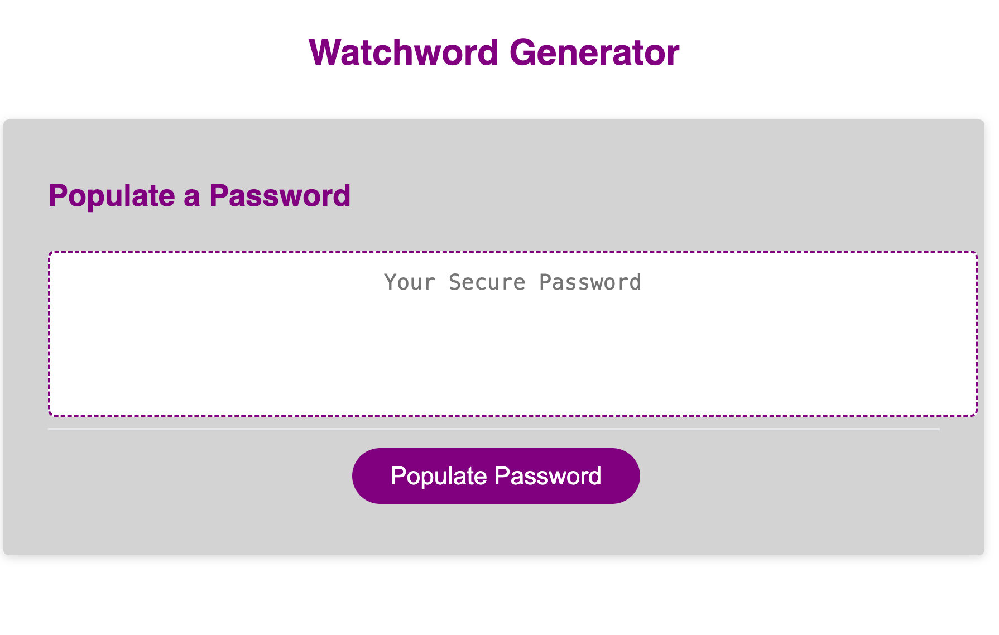
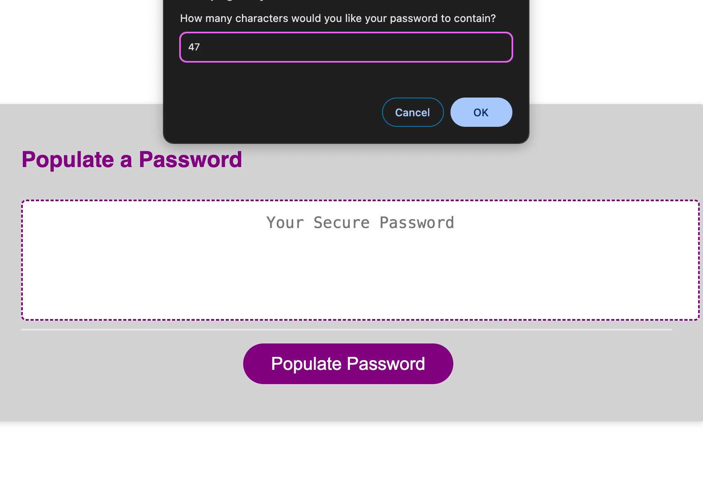
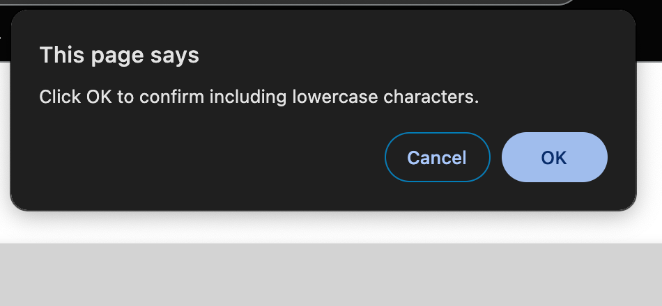

# Watchword Generator Starter Code

## Description
This is a browser based application for an employee to generate a random password with a specific criteria. This application features a polished UI and responsive HTML, CSS and Javascript to produce a secure password.

## User Story
As an employee with access to sensitive data, I want to randomly generate a password that meets certain criteria so that I can create a strong password that provides greater security.

## Screenshot

This screenshot shows the password generator prior to the search criteria.

This screenshot provides the options the user has.

This screenshot shows an example of the search results. 

## Deployed Application
[Example: https://your-deployed-app-url.com]
